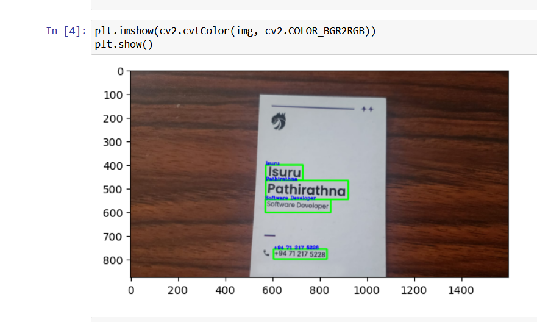

# Python Image Text Extractor

## Project Description

The "Python Image Text Extractor" is a Python application designed to extract and recognize text from images.

## Features

- **Text Extraction**: Extract text content from images, including handwritten and printed text.

- **Multi-Language Support**: Recognize text in multiple languages.
  
- **Output Formats**: Save extracted text as text files.

## Usage

1. **Installation**:
   - Clone the repository: `git clone https://github.com/your-username/your-repo.git`
   - Install dependencies: `pip install -r requirements.txt`

2. **Run the Application**:
   - Ensure that you have installed the necessary libraries and dependencies. If not, you can use the following command to install the required libraries:
   - python
   - !pip install your-library-name

4. **Results**:
   - Extracted text is saved in the text output format.
   - View the result in the "result.png" file (example result).

## License

This project is licensed under the MIT License. See the [LICENSE](LICENSE) file for details.

